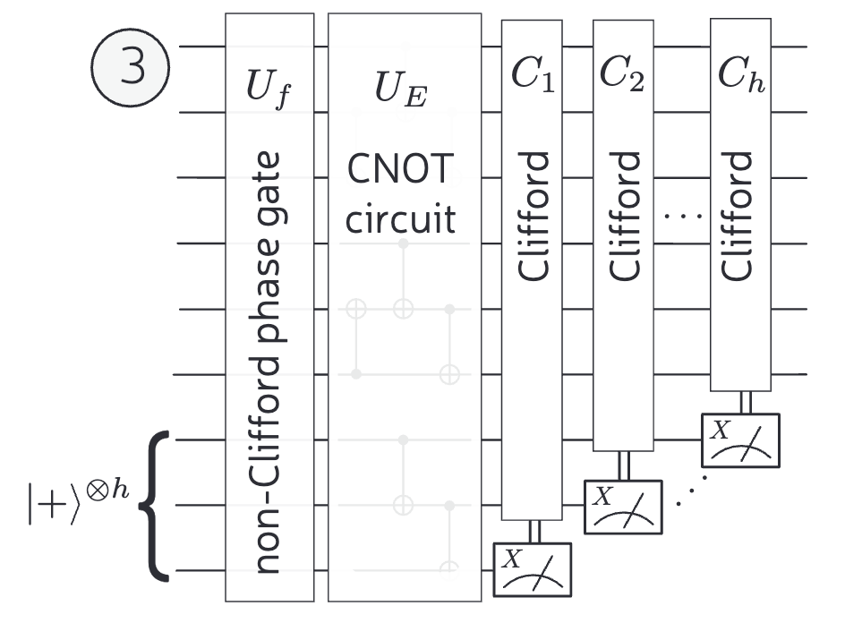

# Qats 😼
_Team solving the Quantinuum challenge in ETH Quantum Hackathon 2024._
 

## Overview
Welcome to the Qats' Github repo! We have passionately worked on the problem of obtaining the Heyfron-Campbell normal form of a quantum circuit. 

## Challenge Summary
The hackathon challenge focuses on the conversion of quantum circuits into the Heyfron-Campbell normal form, a crucial element in reducing T gate count in quantum circuits. This optimizes quantum computation, and is crucial for quantum error correction. The form allows us to write the quantum circuit with the following structure:

- **Non-Clifford Phase Gate:** Referred to as a Diagonal gate.
- **CNOT Circuit:** Composed exclusively of CX gates, akin to classical reversible circuits.
- **Clifford Blocks:** These are circuits controlled classically based on the measurement of ancilla qubits, facilitating the selection of measurement bases.

### Why is this relevant?
The Heyfron-Campbell normal form significantly simplifies the quantum computing process by isolating the "classically hard" part to just the diagonal gates. These gates add phases to computational basis states, dependent on ancilla qubits. The structure of this form allows for the optimization of T gates, which are typically the most costly, making everything else primarily Clifford-based and easier to manage.

### Steps to implement Heyfron-Campbell normal form:
1. **Hadamard Gadgetisation**
2. **Pauli Pushing**
3. **Rinse and Repeat**
4. **Checking correctness**

We successfully implemented all the steps, and show our results in our presentation. We look forward to see you there!

## Acknowledgements

**Team members**
[Khurshed](https://github.com/GlazeDonuts), 
[Ekaterina](https://github.com/eparu), [Pablo](https://github.com/qrodenas), [Florian](https://github.com/floriancttr)

